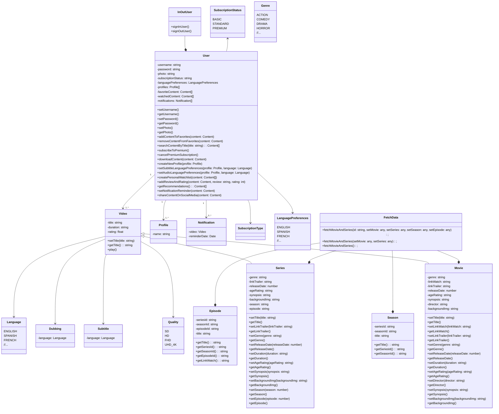
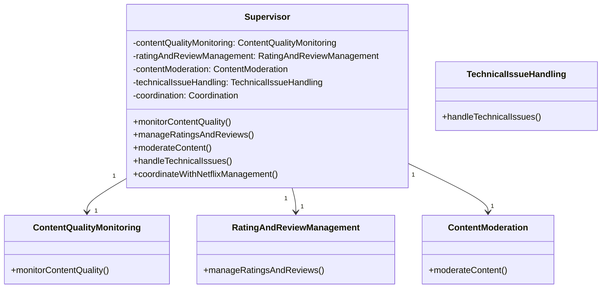

# No. 1
Use Case Disney+

Use Case User

  
Lihat Daftar

- User dapat melakukan signin dan signout
- User dapat melakukan login dan logout
- User dapat berlangganan paket menonton
- User dapat berhenti berlangganan paket menonton
- User dapat melihat dashboard aplikasi yang menampilkan daftar film dan series
- User dapat memilih film atau series yang diinginkan
- User dapat melihat informasi lebih lengkap dari suatu film atau series setelah memilihnya
- User dapat menonton trailer dari film dan series yang diinginkan
- User dapat menonton film dan series yang diinginkan
- User dapat menambahkan film ke daftar tontonan (watch list)
- User dapat mencari film yang diinginkan
- User dapat membuat dan melihat daftar tontonan (watch list)
- User dapat memilih kategori konten yang ditampilkan berdasarkan konten original disney, konten film, dan konten series
- User dapat memilih kategori konten yang ditampilkan berdasarkan konten rumah produksi atau tayangan populer, seperti Disney, Pixar, Marvel, Star Wars, dan National Geographic
- User dapat mengakses konten untuk anak-anak
- User dapat mengunduh film dan acara TV dari Disney+ untuk ditonton secara offline
- User dapat membuat beberapa profil pengguna di bawah satu akun
- User dapat fitur kontrol orang tua yang memungkinkan orang tua atau penjaga anak untuk mengontrol jenis konten yang dapat diakses oleh anak-anak di dalam aplikasi
- User dapat mengakses ke konten dokumenter
- User dapat melakukan maraton serial TV favorit
- User dapat mengakses konten yang disesuaikan dengan wilayah atau negara tertentu
- User dapat menonton konten bersama dengan teman atau keluarga mereka secara online
- User dapat melihat video promo eksklusif untuk film dan acara TV yang akan datang
- User dapat menyesuaikan pengaturan subtitle dan audio pada Disney+
- User dapat melihat materi bonus, seperti cuplikan di balik layar, wawancara, dan konten tambahan terkait film dan acara TV tertentu
- User dapat melihat rekomendasi konten berdasarkan riwayat tontonan sebelumnya
- User dapat mendapatkan notifikasi mengenai rilis film atau episode series baru
- User dapat melihat daftar film dan series yang sedang populer
- User dapat membagikan konten yang mereka sukai ke media sosial
- User dapat melihat daftar film dan series yang akan datang

Use Case Manajemen/Administrator Perusahaan

  
Lihat Daftar

- Manajemen/Administrator dapat mengatur konten aplikasi
- Manajemen/Administrator dapat melihat statistik data dan laporan aplikasi
- Manajemen/Administrator dapat menambahkan banner, promosi, iklan, kampanye, dan lain-lain
- Manajemen/Administrator dapat menambahkan mitra konten
- Manajemen/Administrator dapat melakukan pengembangan dan pengujian fitur lama dan baru aplikasi

Use Case Direksi Perusahaan

  
Lihat Daftar

- Direksi dapat melihat dan mengawasi konten aplikasi
- Direksi dapat melihat statistik data dan laporan aplikasi
- Direksi dapat melihat dan mengawasi banner, promosi, iklan, kampanye, dan lain-lain
- Direksi dapat melihat dan mengawasi mitra konten
- Direksi dapat mengawasi pengembangan dan pengujian fitur baru aplikasi

Sudah terimplementasi/Prioritas

  
Lihat Daftar

- User dapat melakukan login dan logout
- User dapat melihat dashboard aplikasi yang menampilkan daftar film dan series
- User dapat memilih film atau series yang diinginkan
- User dapat melihat informasi lebih lengkap dari suatu film atau series setelah memilihnya
- User dapat menonton trailer dari film dan series yang diinginkan
- User dapat menonton film dan series yang diinginkan (baru film yang benar-benar fungsional)
- Manajemen/Administrator dapat mengatur konten aplikasi (semacam CRUD, tetapi baru untuk film dan merupakan aplikasi terpisah)

Belum terimplementasi

  
Lihat Daftar

 - User dapat melakukan signin dan signout
 - User dapat berlangganan paket menonton
 - User dapat berhenti berlangganan paket menonton
 - User dapat menambahkan film ke daftar tontonan (watch list)
 - User dapat mencari film yang diinginkan
 - User dapat membuat dan melihat daftar tontonan (watch list)
 - User dapat memilih kategori konten yang ditampilkan berdasarkan konten original disney, konten film, dan konten series
 - User dapat memilih kategori konten yang ditampilkan berdasarkan konten rumah produksi atau tayangan populer, seperti Disney, Pixar, Marvel, Star Wars, dan National Geographic
 - User dapat mengakses konten untuk anak-anak
 - User dapat mengunduh film dan acara TV dari Disney+ untuk ditonton secara offline
 - User dapat membuat beberapa profil pengguna di bawah satu akun
 - User dapat fitur kontrol orang tua yang memungkinkan orang tua atau penjaga anak untuk mengontrol jenis konten yang dapat diakses oleh anak-anak di dalam aplikasi
 - User dapat mengakses ke konten dokumenter
 - User dapat melakukan maraton serial TV favorit
 - User dapat mengakses konten yang disesuaikan dengan wilayah atau negara tertentu
 - User dapat menonton konten bersama dengan teman atau keluarga mereka secara online
 - User dapat melihat video promo eksklusif untuk film dan acara TV yang akan datang
 - User dapat menyesuaikan pengaturan subtitle dan audio pada Disney+
 - User dapat melihat materi bonus, seperti cuplikan di balik layar, wawancara, dan konten tambahan terkait film dan acara TV tertentu
 - Manajemen/Administrator dapat melihat statistik data dan laporan aplikasi
 - Manajemen/Administrator dapat menambahkan banner, promosi, iklan, kampanye, dan lain-lain
 - Manajemen/Administrator dapat menambahkan mitra konten
 - Manajemen/Administrator dapat melakukan pengembangan dan pengujian fitur baru aplikasi
 - Direksi dapat melihat dan mengawasi konten aplikasi
 - Direksi dapat melihat statistik data dan laporan aplikasi
 - Direksi dapat melihat dan mengawasi banner, promosi, iklan, kampanye, dan lain-lain
 - Direksi dapat melihat dan mengawasi mitra konten
 - Direksi dapat mengawasi pengembangan dan pengujian fitur baru aplikasi

# No. 2
Catatan: class diagram ini merupjkakan perkiraan jika semua use case terimplementasi
- Class Diagram Usecase User
 

- Class Diagram Usecase Manajemen

```mermaid
classDiagram
    class Management {
        -contentManagement: ContentManagement
        -dataAnalysis: DataAnalysis
        -userManagement: UserManagement
        -financeManagement: FinanceManagement
        -promotionManagement: PromotionManagement
        -contentPartnerManagement: ContentPartnerManagement
        -bugManagement: BugManagement
        -internationalContentManagement: InternationalContentManagement
        -userBehaviorAnalysis: UserBehaviorAnalysis
        -featureDevelopment: FeatureDevelopment
        -marketResearch: MarketResearch
        -infrastructureManagement: InfrastructureManagement
        -affiliateProgramManagement: AffiliateProgramManagement
        +addContent(content: Content)
        +analyzeData()
        +manageUsers()
        +manageFinance()
        +managePromotion()
        +manageContentPartners()
        +manageBugs()
        +manageInternationalContent()
        +analyzeUserBehavior()
        +developFeatures()
        +conductMarketResearch()
        +manageInfrastructure()
        +manageAffiliateProgram()
    }

    class ContentManagement {
        +addContent(content: Content)
    }

    class DataAnalysis {
        +analyzeData()
    }

    class UserManagement {
        +manageUsers()
    }

    class FinanceManagement {
        +manageFinance()
    }

    class PromotionManagement {
        +managePromotion()
    }

    class ContentPartnerManagement {
        + manageContentPartners()
    }

    class InternationalContentManagement {
        +manageInternationalContent()
    }

    class UserBehaviorAnalysis {
        +analyzeUserBehavior()
    }

    class FeatureDevelopment {
        +developFeatures()
    }

    class MarketResearch {
        +conductMarketResearch()
    }

    class InfrastructureManagement {
        +manageInfrastructure()
    }

    class AffiliateProgramManagement {
        +manageAffiliateProgram()
    }

    Management "1" --> "1" ContentManagement
    Management "1" --> "1" DataAnalysis
    Management "1" --> "1" UserManagement
    Management "1" --> "1" FinanceManagement
    Management "1" --> "1" PromotionManagement
    Management "1" --> "1" ContentPartnerManagement
    Management "1" --> "1" BugManagement
    Management "1" --> "1" InternationalContentManagement
    Management "1" --> "1" UserBehaviorAnalysis
    Management "1" --> "1" FeatureDevelopment
    Management "1" --> "1" MarketResearch
    Management "1" --> "1" InfrastructureManagement
    Management "1" --> "1" AffiliateProgramManagement
```

- Class Diagram Usecase Direksi

# No. 3
Single Responsibility Principle - Setiap class hanya punya satu tugas. Sehingga kelas itu cuman punya satu alasan untuk berubah, yakni merubah satu tugas yang diberikan padanya. Gambar di bawah menunjukkan bahwasannya class Episode hanya akan berubah untuk merubah struktur episode dari series yang ada saja.

Open For extension, Closed For Modification Principle - Class yang sudah ditulisi dan disepakati perilakunya harus mudah diwariskan , dan tidak boleh diubah-ubah lagi. Cara mengubahnya dengan mewariskan ke class turunan yang punya perilaku baru. Gambar di bawah menunjukkan bahwasannya class Video merupakan abstract class umum yang menjadi patokan untuk class turunannya dalam memenuhi berbagai tugas yang ada, seperti class Movie yang bertindak sebagai film, dan kelas Series yang berlaku sebagai seri dengan season dan episode yang dimiliki. Keduanya sama-sama video, tetapi ada atribut dan pola yang berbeda di antara keduanya.

Liskov Substitute Principle - Class turunan harus bisa menjadi pegganti class parrent-nya. Tidak boleh methodnya di-override lalu dikosongkan/lempar eksepsi (degenerate implementation). Masih berhubungan dengan yang sebelumnya, gambar di bawah menunjukkan bahwasannya class Video merupakan abstract class umum yang digantikan perannya oleh class turunannya dalam memenuhi berbagai tugas yang ada. Pada kasus ini, class Movie merupakan class yang menangani video dengan satu konten saja, sedangkan class Series menangani video yang memiliki konten turunan, yaitu season dan episode. Keduanya sama-sama video, tetapi ada atribut dan pola yang berbeda di antara keduanya.

Interface Segregation Principle - Satu interface Tidak boleh menyediakan semua service (god class) bagi semua jenis client objek. Satu interface mempunyai tugas spesifik untuk tiap klien-nya. Prinsip I pada SOLID ini dapat terlihat juga dari gambar sebelumnya. Interface atau abstract class video ya khusus untuk video, dan abstract yang lainnya terpisah. Tidak menjadi satu abstract yang sangat umum.

Dependency inversion Principle - Modul level tinggi tidak bergantung pada modul level rendah. Keduanya bergantung pada abstraksi. Sementara abstraksi tidak bergantung kepada detail. Malah detail yang harus bergantung pada abstraksi. Hal ini juga tergambar pada gambar-gambar sebelumnya, yaitu modul untuk movie ya menggunakan class Movie yang merupakan class yang lebih rendah dari Video. Movie dan Series tergantung pada Video, tidak sebaliknya.

Berikut ini adalah link source codenya: https://github.com/Pancadrya/Praktikum-PBO/tree/main/Tugas/04%20-%20Project%20Disney%2B%20Clone%20TS/disney-plus-clone-ts/src/model

# No. 4
Project Disney+ Clone ini menggunakan design pattern MVC (Model, View, Controller). Pattern ini digunakan dengan memisahkan antara kode untuk struktur (Model), kode untuk tampilan (View), dan kode untuk Logika (Controller). Dapat dilihat pada gambar dibawah terdapat folder components yang menampung file-file tampilan, folder Controllers yang berisi logika, dan folder model yang berisi class-class dan abstract yang menjadi rujukan struktur kode aplikasi. Penggunaan nama components (bukan view) karena digunakannya reactJS yang memfasilitasi pembuatan UI berbasis komponen. Contoh praktiknya dapat dilihat ketika di komponen Detail tidak ada logic yang diperlukan untuk mengampil data dari api, semua itu dilakukan pada FetchData di controllers. Meskipun tidak 100% rapi implementasi design patternnya, tetapi sudah cukup mewakili penggunaan dari design pattern pada program aplikasi.

Contoh Bagian Model

Contoh Bagian View

Contoh Bagian Controller

Berikut ini adalah link source codenya: https://github.com/Pancadrya/Praktikum-PBO/tree/main/Tugas/04%20-%20Project%20Disney%2B%20Clone%20TS/disney-plus-clone-ts/src

# No. 5
Database yang digunakan pada project ini adalah Firebase Cloud Firestore yang merupakan salah satu database noSQL. Koneksi antara database dengan aplikasi ditengahi oleh API/Web Service. Dapat dilihat pada gambar-gambar di bawah, API terhubung dengan database dengan secret key sehingga dapat menarik data collection, doc, beserta properti-propertinya. API dibuat menggunakan NodeJS, ExpressJS, Cors, dan Javascript. API merumuskan operasi CRUD dengan dibagi menjadi beberapa endpoint (routes). Pada aplikasi utama, endpoint dari API itu lah yang digunakan untuk menarik data dari database.

Aplikasi atau Program Web Service/API

Aplikasi Utama Bagian Fetch Data

Berikut adalah link source codenya:
- https://github.com/Pancadrya/Praktikum-PBO/blob/main/Tugas/04%20-%20Project%20Disney%2B%20Clone%20TS/web-service-disney-plus-clone/functions/index.js
- https://github.com/Pancadrya/Praktikum-PBO/blob/main/Tugas/04%20-%20Project%20Disney%2B%20Clone%20TS/disney-plus-clone-ts/src/controllers/FetchData.tsx

# No. 6
Masih berhubungan dengan soal sebelumnya (lihat gambar-gambar pada nomor 5), Web Service (API) pada project ini dibuat menggunakan NodeJs, ExpressJS, Cors, Firebase Admin, Firebase Functions, dan Javascript. Web service dihubungkan dengan database melalui pengakomodiran serviceAccountKey. Dengan terhubungnya Web Service dengan database, dibuatlah fungsi-fungsi untuk melakukan CRUD, seperti getMovie, getAllMovie, dan lain-lain. Setelah itu digunakanlah express dan cors untuk menyediakan endpoint atau routes bagi aplikasi client untuk merequest dan mendapatkan response data melalui http connection.

Belum semua fungsi dioptimalkan, masih ada yang belum dibuat ataupun meragukan. Tetapi untuk movie/film, semua CRUD sudah berjalan cukup baik. Dibuat juga aplikasi khusus untuk Content Management, dimana pihak manajemen aplikasi dapat menambahkan, melihat, meng-update, menghapus data film dari aplikasi tersebut.

Berikut adalah link source codenya:
- https://github.com/Pancadrya/Praktikum-PBO/blob/main/Tugas/04%20-%20Project%20Disney%2B%20Clone%20TS/web-service-disney-plus-clone/functions/index.js
- https://github.com/Pancadrya/Praktikum-PBO/tree/main/Tugas/04%20-%20Project%20Disney%2B%20Clone%20TS/crud-admin-disney-plus-clone/src

# No. 7
GUI aplikasi Disney+ Clone ini dibuat menggunakan ReactJS dengan bantuan library react, firebase, styled-components, slick-carousel, bootstrap, redux, dan router-dom. Di sini, user dapat melakukan berbgaai kegiatan seperti dijelaskan di bawah ini:

Pada saat user membuka aplikasi, user langsung diarahkan ke halaman login. Di sini user dapat melakukan login menggunakan akun Gmail. Autentifikasi menggunakan fitur Auth dari Firebase. Jika valid maka user akan langsung masuk ke halaman beranda atau dashboard aplikasi. Hingga saat ini, beberapa fitur seperti berlangganan belum terimplementasi sehingga tombol GET ALL THERE baru sebatas hiasan, belum fungsional.

Di atas adalah beranda aplikasi. Terdapat header dengan segenap tombolnya di atas dan berbagai film dan series yang ditampilkan di bagian bawah header. User dapat memilih film yang akan dilihat informasi lebih rincinya. Selain itu, user juga bisa melakukan logout dengan mengarahkan kursor ke lambang pulat berisi foto user. Tombol logout akan muncul dan user dapat menekannya untuk keluar dari akun aplikasi. Hingga saat ini, user belum bisa melihat efek apapun juka menekan tombol selain logout, yang lainnya belum terimplementasi.

Pada laman detail ini ditampilkan berbagai informasi mengenai film atau series yang dipilih. Perbedaannya, jika film akan langsung muncul tombol PLAY, sedangkan series akan muncul tombol dropdown yang menampung tombol untuk menonton season dan episode dari series tersebut. Saat menekan tombol Trailer, maka akan muncul video embed dari Youtube, sedangkan saat menekan PLAY, maka akan muncul laman tonton film pada Disney+ Hotstar yang asli, sehingga untuk mengaksesnya, user perlu memiliki langganan di sana.

Hingga saat ini, tombol yang berfungsi baru PLAY dan TRAILER, sisanya belum terimplementasi. Pemutaran video sendiri baru sebatas mengarahkan user atau memunculkan layanan pihak luar. Berbagai hal yang belum berfungsi pada saat ini mungkin baru akan ditambahkan pada pengembangan selanjutnya.

Berikut adalah link source codenya: https://github.com/Pancadrya/Praktikum-PBO/tree/main/Tugas/04%20-%20Project%20Disney%2B%20Clone%20TS/disney-plus-clone-ts

# No. 8
Pada project ini, HTTP connection diimplementasikan pada bagian pendefinisian rute-rute HTTP menggunakan Express.js. Pada setiap definisi rute HTTP connection, di sana digunakan metode-metode HTTP seperti get, post, put, dan delete untuk menangani permintaan HTTP yang datang ke endpoint yang sesuai. Misalnya, app.get("/api/movies/:id", ...) akan menangani permintaan HTTP GET ke endpoint /api/movies/:id.

Selain itu, HTTP connection ini juga memungkinkan adanya pengiriman respons HTTP menggunakan objek res yang digunakan untuk mengatur status kode HTTP (misalnya, res.status(200) untuk mengatur status 200 OK) dan mengirim data sebagai respons (misalnya, res.send(result) untuk mengirim hasil operasi sebagai respons). Di luar itu, kode ini juga menggunakan Firebase Functions untuk mengemas aplikasi Express.js sebagai fungsi Firebase (exports.app = functions.https.onRequest(app)).

Berikut adalah bagian-bagian yang menggunakan HTTP connection dalam kode tersebut:

Berikut adalah link source codenya: https://github.com/Pancadrya/Praktikum-PBO/blob/main/Tugas/04%20-%20Project%20Disney%2B%20Clone%20TS/web-service-disney-plus-clone/functions/index.js

# No. 9
Video demonstrasi atau presentasi dari aplikasi Disney+ Clone ini tersedia pada link berikut: https://youtu.be/U6PwxT5Y-fY

# No. 10
-

# Catatan Penting
Belum semua fungsi yang ada ditampilan berjalan. Selain itu, pada bagian source code terdapat beberapa file kode yang tidak terpakai secara fungsional dan juga beberapa perintah yang dicomment dan belum dihapus. Hal tersebut dikarenakan project ini dibuat dengan berbagai eksperimen penggunaan kode dalam waktu yang relatif singkat sehingga kode-kode dan file-file yang pernah diuji belum terarsip dengan baik dan dihapuskan saat ini.
